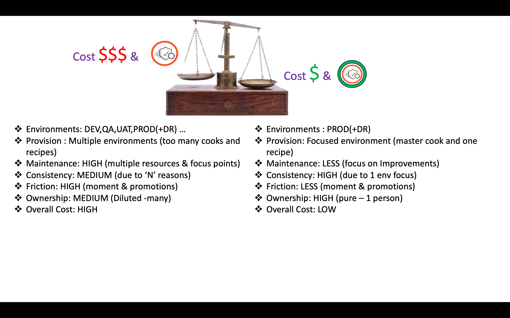
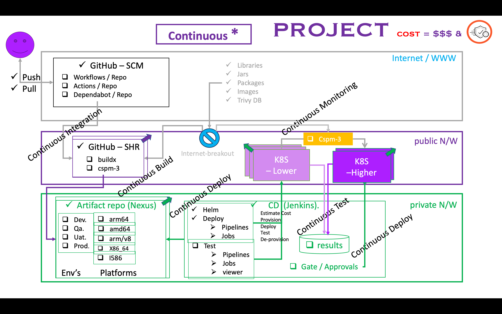
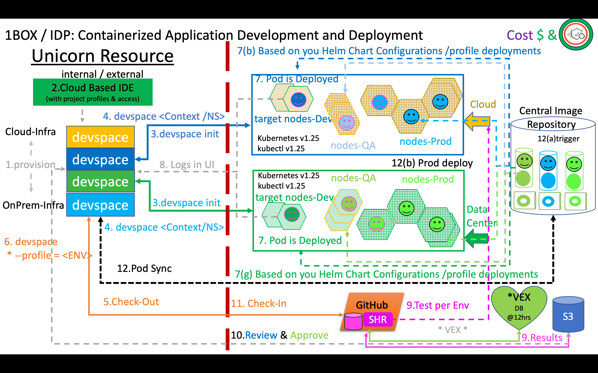
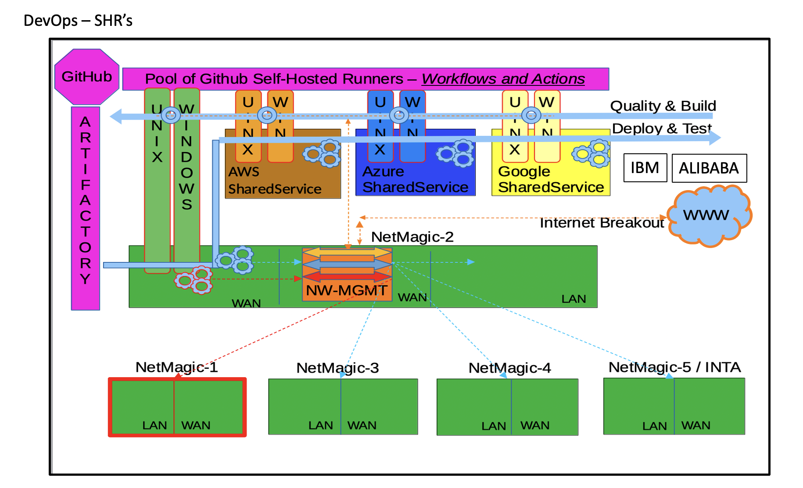

# Shift Left Vs Dive Right

  

<u>Shift Left?</u>  

<table>
<tr><td>Provider</th><th>Runners</th><th>Workflow->Jobs->Tasks</th></tr>
<tr><td>ABC</td><td>Provision VM in ABC [ubuntu-latest]</td><td>Download source,patch,complie & bundle...</td></tr>
<tr><td>EFG</td><td>Provision VM in EFG [windows-latest]</td><td>Download pre-builds,complie & bundle...</td></tr>
<tr><td>LMN</td><td>Provision VM in LMN [macos-latest]</td><td>Download dmg,bundle...)</td></tr>
</table>

<u> Shift Left - Self-Hosted-Runners? </u>
<table>
<tr><td>Provider</th><th>Runners</th><th>Comments</th></tr>
<tr><td>ABC</td><td>SHR for Python 3.1 on ubuntu-latest</td><td>Static and Dynamic binding taken care..SHIP for consumer.</td></tr>
<tr><td>ABC</td><td>SHR for Python 3.1 on windows-latest</td><td>Static and Dynamic binding taken care..SHIP for consumer.</td></tr>
<tr><td>EFG</td><td>SHR for Python 3.5 on ubuntu-latest</td><td>Static and Dynamic binding taken care..SHIP for consumer.</td></tr>
<tr><td>UNX</td><td>SHR for Python 3.7 on ubuntu-latest</td><td>Static and Dynamic binding taken care..SHIP for consumer.</td></tr>
<tr><td>RHL</td><td>SHR for Qmail on RHEL-el3</td><td>uid=201,gid=502. Can run with other uid & gid..SHIP *.</td></tr>
<tr><td>SOL</td><td>SHR for Qmail on Solaris-10</td><td>.uid=1001,gid=5002 baked into package.Can't run with other uid & gid..SHIP **.</td></tr>
</table>

<b><u> Questions </u><b> 
Is the 'VM in ABC' same where am running workloads in cloud-xyz ?  
'SHR' bit-size,arch-type,chip-sets supported by cloud-xyz at regions (place,time,situation)?  
Are the compliance/regulatory/security constraints same where am building vs where am running?  
Are Container runtime and layers same?  
Many more .....

After doing all these, IS the goal achieved? and what is the COST?  

Continuous Improvements  

Engineering Experience  

<u> What is Dive Right? </u>  
 ....Work Inside....   

 <h1> ALL-IN-ONE   
      continuous improvements of <u> THE ONE </u> with complete 360 degrees and 100 percent <u> FOCUS </u> </h1>

  

